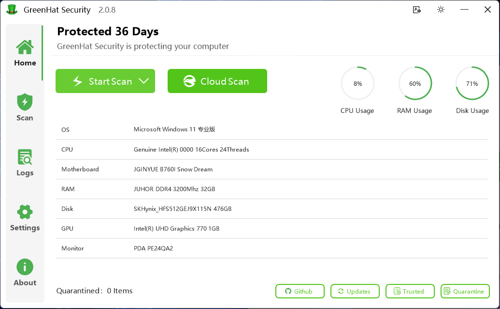
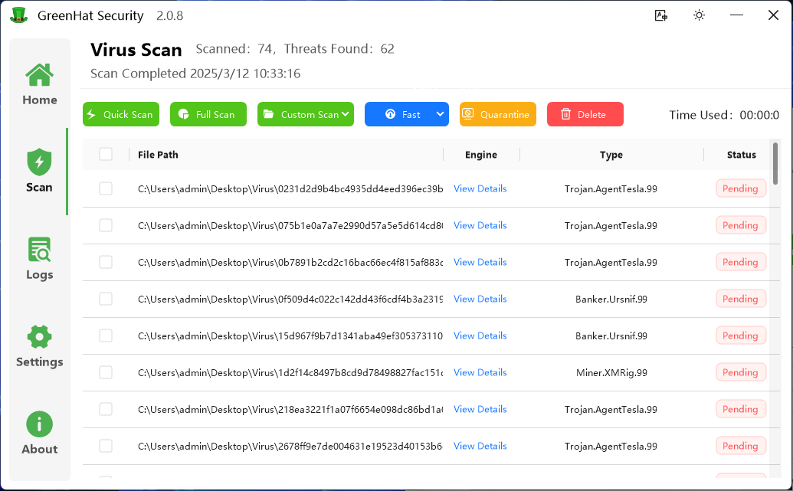
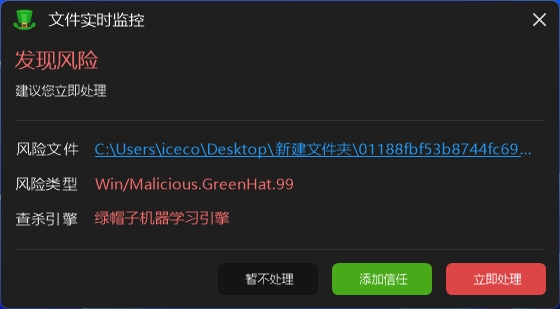

  
  <h1>GreenHat Security</h1>

[简体中文](./README.md) | English

## Introduction
A security protection software for Windows operating systems, specifically customized for Chinese users, integrating multiple domestic antivirus engines.

## Features
* Cloud file analysis with Hunter Sword
* Virus scanning (Quick scan, Full scan, Custom scan)
* System configuration viewer
* Log viewer
* Protection settings (Process protection, File protection, Boot protection, Startup settings, Engine configuration, etc.)
* Trusted zone functionality
* Quarantine zone functionality
* Update feature
* i18n

## System Requirements
* Operating System: Windows 10+
* Runtime: .NET Framework 4.8+
* RAM: 1GB+
* Disk Space: 500MB+

## Scanning Engines
* [GreenHat Machine Learning Engine (Local engine, self-developed and added in version 2.0.5)](https://github.com/xiangyongjun/GreenHat)
* [Hunter Sword Cloud Engine (Cloud engine)](https://www.virusmark.com)
* [Kelo Machine Learning Engine (Local engine, removed after version 2.0.4)](https://github.com/kelomina/KoloVirusDetector_ML)
* [ANK Skylark Lightweight ML Engine (Local engine, removed after version 2.0.4)](https://www.ankml.top)
* [T-Safety Light Arc YARA Engine (Local engine, removed after version 2.0.4)](https://space.bilibili.com/3493145551571279)
* [czk Antivirus Engine (Cloud engine, removed after version 2.0.4)](https://weilai.szczk.top/api/#introduction)
* [Kolo Cloud Threat Intelligence Center (Cloud engine, removed after version 2.0.4)](https://github.com/kelomina/KoloVirusDetector_ML)
* [Rapid Security Cloud Engine (Cloud engine, removed after version 2.0.4)](https://www.hkts.fun)

## Technology Stack
* [C#](https://learn.microsoft.com/zh-cn/dotnet/csharp)
* [.NET Framework 4.8](https://dotnet.microsoft.com/zh-cn/download/dotnet-framework/net48)
* [AntdUI](https://github.com/AntdUI/AntdUI)
* [SqlSugar](https://github.com/DotNetNext/SqlSugar)

## Important Notes
> The source code does not include the engine, Config.db, or GreenHatService.exe files. These must be [download](https://github.com/xiangyongjun/GreenHat/releases) and extracted to locate the corresponding files.

## Community
> Self-made Antivirus QQ Group: 753603544

> Hunter Sword File Analysis Cloud QQ Group: 871678083 

## Software Screenshots

---

