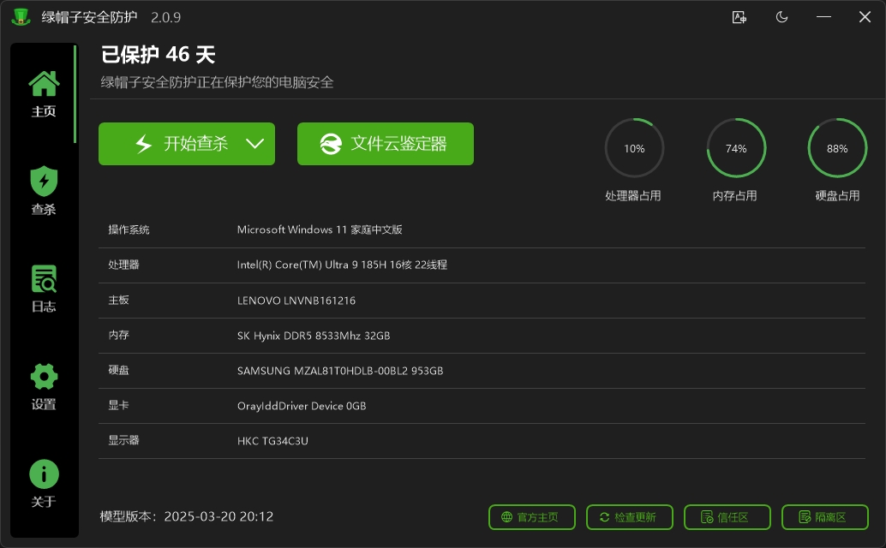
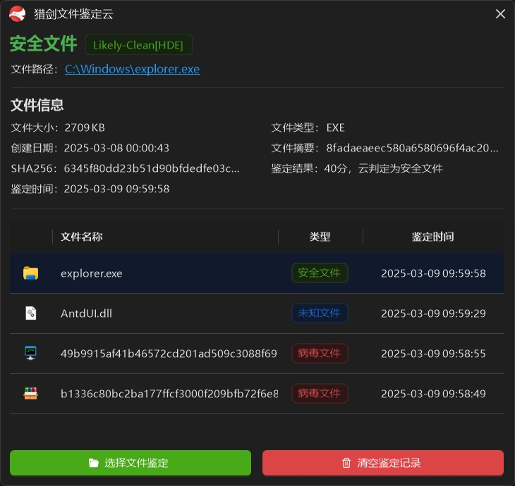
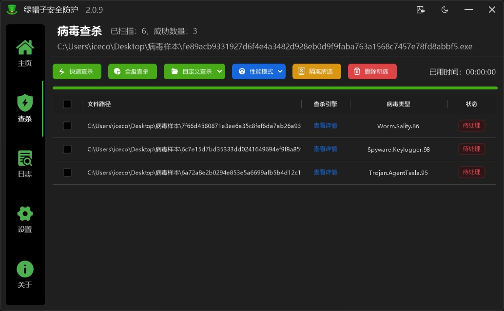
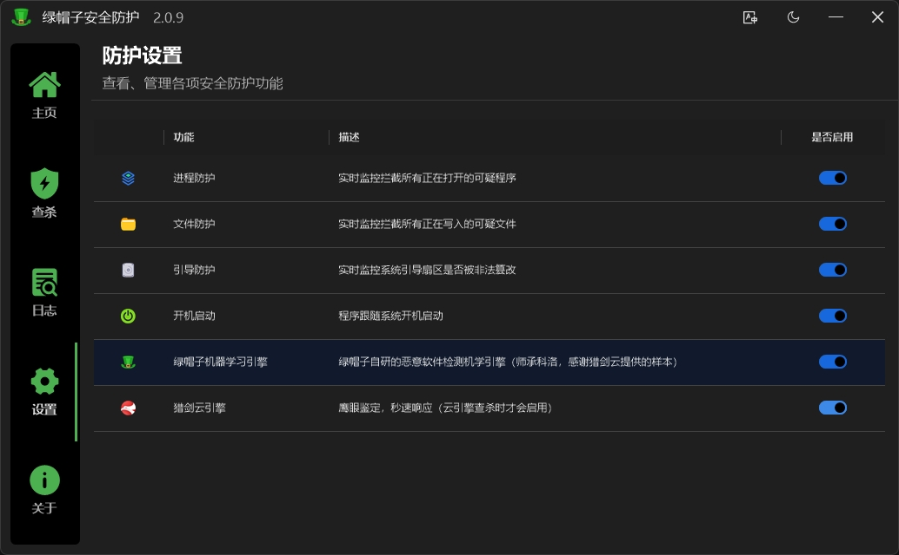

  
  <h1>绿帽子安全防护</h1>

## 简介
一款专为国人定制打造，集多个国产杀毒引擎于一身的 Windows 操作系统安全防护软件

## 功能
* 病毒查杀（快速查杀、全盘查杀、自定义查杀）
* 电脑配置查看
* 日志查看
* 防护设置（进程防护、文件防护、引导防护、开机启动、查杀引擎设置等）
* 信任区功能
* 隔离区功能
* 更新功能

## 运行环境
* 操作系统：Windows 7、8、10、11等
* 运行时：.NET Framework 4.8+
* 运行内存：1G+
* 硬盘容量：500M+

## 查杀引擎
* [科洛机器学习引擎（本地引擎）](https://github.com/kelomina/KoloVirusDetector_ML)
* [ANK云雀轻量机学引擎（本地引擎）](https://www.ankml.top)
* [T-Safety光弧YARA引擎（暂不可用，等待引擎作者修复）](https://space.bilibili.com/3493145551571279)
* [猎剑云引擎（云引擎）](https://www.ankml.top)
* [czk杀毒引擎（云引擎）](https://weilai.szczk.top/api/#introduction)
* [科洛云端威胁情报中心（云引擎）](https://github.com/kelomina/KoloVirusDetector_ML)

## 技术栈
* [C#](https://learn.microsoft.com/zh-cn/dotnet/csharp)
* [.NET Framework 4.8](https://dotnet.microsoft.com/zh-cn/download/dotnet-framework/net48)
* [AntdUI](https://github.com/AntdUI/AntdUI)
* [SqlSugar](https://github.com/DotNetNext/SqlSugar)

## 必读（重要）
> 本源码不含 查杀引擎、数据库、开机启动服务 等文件，需[自行下载](https://github.com/xiangyongjun/GreenHat/releases)安装后找到对应缺少的 engine、Config.db、GreenHatService.exe 等文件

## 交流
> 自制杀软QQ交流群：753603544

## 软件截图

---

